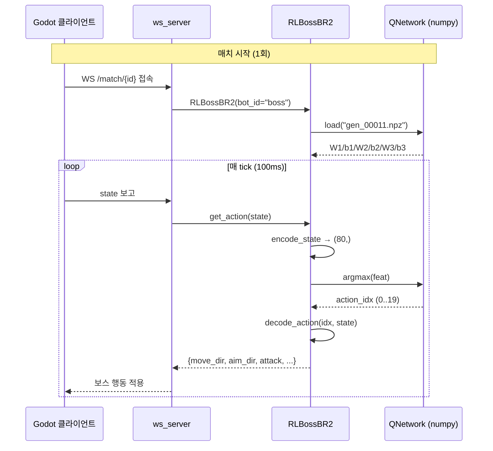

# 02. 서빙 — 백엔드가 RL 보스를 실제 매치에서 실행하는 방법

> [README](README.md) · [01-design](01-design.md) · **02-serving** · [03-infrastructure](03-infrastructure.md) · [04-status](04-status.md)

이 문서는 *운영 백엔드의 디버깅* 을 위한 자료다. 학습 산출물이 어떻게 운영 매치에서 행동으로 이어지는지를 코드 경로로 추적한다.

---

## 1. 진입점 — 난이도 매핑

`backend/BattleRoyale2/bots/boss/__init__.py`:

```python
BossEasyBot   = RuleBossEasyBR2     # 난이도 "하"
BossMediumBot = RuleBossMediumBR2   # 난이도 "중"
BossHardBot   = _resolve_hard_boss()  # 난이도 "상" — RL or Medium 폴백

BOSS_BOT_BY_DIFFICULTY = {
    "하": BossEasyBot,
    "중": BossMediumBot,
    "상": BossHardBot,
}
```

`_resolve_hard_boss()` 가 부팅 시점에 한 번 실행되어 BossHardBot 을 결정한다 — **부팅 후 가중치 추가는 재시작 필요**.

---

## 2. 부팅 시 RL 활성화 결정

```python
def _resolve_hard_boss():
    try:
        from .rl import RLBossBR2, DEFAULT_CHECKPOINT_DIR
    except Exception:
        # numpy 미설치 등 → Medium 폴백
        return RuleBossMediumBR2

    if not DEFAULT_CHECKPOINT_DIR.exists():
        return RuleBossMediumBR2
    if not list(DEFAULT_CHECKPOINT_DIR.glob("gen_*.npz")):
        return RuleBossMediumBR2

    return RLBossBR2
```

플로우:

```
백엔드 부팅
  │
  ▼
import BattleRoyale2.bots.boss
  │
  ▼
_resolve_hard_boss() 실행
  │
  ├─ numpy import OK?  ── no ─► RuleBossMediumBR2  (로그: "RL 모듈 import 실패")
  │                              ▲
  ├─ checkpoints 디렉토리 존재? ─ no ──┤
  │                              ▲
  ├─ gen_*.npz 파일 있음?        ── no ──┘
  │
  ▼ yes (모든 조건)
RLBossBR2 ← BossHardBot ← BOSS_BOT_BY_DIFFICULTY["상"]
```

> 폴백이 자주 발생하는 시점: 학습 직후 가중치만 GCS 에 올리고 로컬 디렉토리에 다운로드를 안 한 경우. 운영 자동화 시 GCS → 로컬 동기화 필요.

---

## 3. 매치 시작 시 RLBossBR2 인스턴스화

`backend/BattleRoyale2/server/ws_server.py` 에서 `POST /api/games` 처리 시:

```python
cls = BOSS_BOT_BY_DIFFICULTY[difficulty]  # 한국어 키 "하"/"중"/"상"
boss = cls(bot_id="boss", seed=...)        # 매치 시작 시 인스턴스 1개
```

`RLBossBR2.__init__` 동작:

1. `DEFAULT_CHECKPOINT_DIR` 에서 가장 큰 `gen_NNNNN.npz` 찾기
2. `QNetwork.load(path)` — numpy `.npz` 에서 `W1/b1/W2/b2/W3/b3` 행렬 로드
3. 메타데이터(`generation`, `win_rate20`, ...) 로깅
4. 로드 실패 시 **랜덤 가중치 폴백** (성능 보장 X, 운영엔 권장 X)

---

## 4. 매치 진행 — 매 tick 추론 체인

매 tick (100ms) 마다:

```python
def get_action(self, state: dict) -> dict:
    feat = encode_state(state, duration_sec=self._duration)   # (80,) float32
    if self._epsilon > 0 and rng.random() < self._epsilon:
        action_idx = rng.randrange(20)                        # ε-greedy (운영 ε=0)
    else:
        action_idx = self._network.argmax(feat)               # Q 최대 액션
    action = decode_action(action_idx, state, last_move=...)  # dict (7 keys)
    return action
```



추론 비용: 80×256 + 256×128 + 128×20 ≈ 56k float multiply per tick. CPU 단일 코어로 충분 (실측 < 1ms).

---

## 5. 액션 dict 출력 형식

7개 키 dict (학습 액션 공간 20개 + 룰 기반 `use_potion`):

```python
{
    "move_dir":   [dx, dy],   # 단위벡터 또는 [0,0] (STAY)
    "aim_dir":    [dx, dy],
    "attack":     True/False,
    "guard":      True/False,
    "dash":       True/False,
    "pickup":     True/False,
    "use_potion": True/False, # has_potion AND hp <= 100 로 강제
}
```

Godot 클라이언트는 이 dict 를 그대로 받아 캐릭터 입력으로 매핑한다 — 자세한 키-Godot 인풋 매핑은 [`docs/br2_boss_mode_protocol.md`](../br2_boss_mode_protocol.md).

---

## 6. 가중치 (.npz) 포맷

학습 종료 시 `_convert_torch_to_npz()` 가 PyTorch `state_dict` → numpy `.npz` 로 변환:

| 키 | shape | 의미 |
|---|---|---|
| `W1` | (80, 256) | Linear1 weight (in→out, PyTorch 의 transpose) |
| `b1` | (256,) | Linear1 bias |
| `W2` | (256, 128) | Linear2 weight |
| `b2` | (128,) | Linear2 bias |
| `W3` | (128, 20) | Linear3 weight |
| `b3` | (20,) | Linear3 bias |
| `meta_generation` | (1,) | 학습 generation 번호 |
| `meta_episodes` | (1,) | 총 학습 에피소드 |
| `meta_avg_rank20` | (1,) | 최종 20ep 평균 등수 |
| `meta_win_rate20` | (1,) | 최종 20ep 승률 |
| `meta_feature_dim` | (1,) | 80 |
| `meta_action_dim` | (1,) | 20 |
| `meta_h1`, `meta_h2` | (1,) 각 | 256, 128 |
| `meta_trained_at` | (1,) | unix epoch |

> ⚠️ PyTorch `Linear.weight` 는 `(out, in)`, numpy 추론은 `(in, out)` 사용. 변환 시 `.T.astype(np.float32)` 필수.

로드 검증:

```bash
python3 -c "
import numpy as np
z = np.load('bots/boss/rl/checkpoints/gen_00011.npz')
print('keys:', list(z.keys()))
print('W1:', z['W1'].shape, 'W3:', z['W3'].shape)
print('gen:', z['meta_generation'][0], 'win20:', z['meta_win_rate20'][0])
"
```

기대 출력:
```
W1: (80, 256)  W3: (128, 20)
gen: 11  win20: 0.0
```

---

## 7. 로컬 ↔ GCS 동기화

학습 스크립트는 `--upload-gcs` 옵션으로 자동 업로드:

```
final.npz ─┬─► gs://knu-2026-boss-weights/br2/gen_NNNNN.npz
           └─► gs://knu-2026-boss-weights/br2/latest.npz  (alias)
```

**운영 백엔드는 자동 다운로드를 하지 않는다** — 현재는 수동:

```bash
cd ~/loa-main/backend/BattleRoyale2/bots/boss/rl/checkpoints/
gsutil cp gs://knu-2026-boss-weights/br2/latest.npz .
gsutil cp gs://knu-2026-boss-weights/br2/gen_00011.npz .  # 명시 버전 보존용
# 백엔드 재시작 → BossHardBot=RLBossBR2 자동 활성
```

> 자동화 계획: [03-infrastructure.md §4](03-infrastructure.md#4-cloud-scheduler-의도와-현-구현) 참조 — Cloud Scheduler 또는 백엔드 부팅 hook.

---

## 8. 폴백 동작과 사용자 영향

폴백 시 어떻게 보이나:

| 시나리오 | 사용자 매치 화면 | 백엔드 로그 |
|---|---|---|
| 정상 (가중치 있음) | "상" 보스가 RL 정책으로 행동 | `[BR2 RL] 체크포인트 로드: gen_00011.npz` |
| 가중치 없음 | "상" 매치도 일반 진행 (Medium 룰 보스) | `[BR2 boss] RL 체크포인트 없음 — '상' 난이도는 Medium 룰로 폴백` |
| numpy 미설치 | 동상 | `[BR2 boss] RL 모듈 import 실패` |
| 가중치 손상 | RL 인스턴스화는 됨, 추론은 랜덤 weight | `[BR2 RL] 체크포인트 로드 실패 — 랜덤 폴백` |

> **사용자에겐 폴백 발생 사실이 노출되지 않음** (난이도 라벨 그대로 "상"). 디버그 시 백엔드 로그 우선 확인.

운영 정책상 **랜덤 weight 폴백은 위험** — 가중치 손상 감지 시 차라리 Medium 폴백이 안전. 향후 inference.py 에서 손상 감지 → Medium 폴백 raise 추가 검토.

---

## 9. 백엔드 재시작 — 가중치 갱신 적용

`BossHardBot` 은 모듈 import 시점 (=백엔드 부팅) 에 한 번 결정되므로, **가중치 추가/교체 후 백엔드 재시작 필수**.

```bash
# PID 확인
ss -tlnp | grep ":8080"

# 정상 종료 (active_games=0 확인 후)
kill <PID>

# 재시작
cd ~/loa-main/backend && nohup python3 run_server.py > /tmp/backend.log 2>&1 &

# 검증
grep -iE "boss|체크포인트|폴백" /tmp/backend.log
curl http://localhost:8080/battleroyale2/health
```

매치 중 재시작은 진행 중 WS 세션 끊김 — `active_games=0` 확인 후 재시작 권장.

---

## 10. 단위 검증 — 운영 환경 무중단 점검

백엔드 외부에서 import 만으로 RL 체인 검증 가능:

```bash
cd ~/loa-main/backend
python3 -c "
from BattleRoyale2.sim import BR2MiniEnv
from BattleRoyale2.bots.boss import BossHardBot
from BattleRoyale2.rules.boss_mode import BOSS_STAT_MULTIPLIERS

env = BR2MiniEnv(seed=42)
specs = [{'id': 'boss', 'stat': BOSS_STAT_MULTIPLIERS['상'], 'is_boss': True}]
for i in range(3): specs.append({'id': f'u{i}', 'stat': None, 'is_boss': False})
states = env.reset(bots=specs)

boss = BossHardBot(bot_id='boss')
print('class:', type(boss).__name__)         # 'RLBossBR2' 이면 RL 활성

action = boss.get_action(states['boss'])
print('action:', {k: action[k] for k in ['move_dir', 'aim_dir', 'attack']})
"
```

기대:
```
class: RLBossBR2
action: {'move_dir': [.., ..], 'aim_dir': [.., ..], 'attack': True/False}
```

`class: RuleBossMediumBR2` 가 나오면 폴백 — 가중치 다운로드 + 백엔드 재시작 필요.

---

[다음 — 03. 인프라](03-infrastructure.md) →
