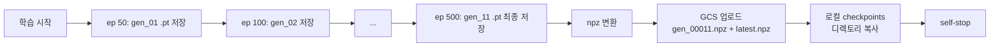

# 03. 인프라 — VM, GCS, 스케줄링 (의도 + 현 구현)

> [README](README.md) · [01-design](01-design.md) · [02-serving](02-serving.md) · **03-infrastructure** · [04-status](04-status.md)

이 문서는 *RL 학습/배포 인프라* 의 현재 상태와 의도된 자동화 설계를 정리한다. **현재 자동화는 부분 구현** — 어느 부분이 의도, 어느 부분이 작동하는지 명시.

---

## 1. 인프라 한눈에

```
              ┌──────────────────────────────────────────────┐
              │            GCP project: knu-2026-hangloss0331           │
              │                                              │
   ┌────────┐ │   ┌────────────────┐    ┌──────────────────┐ │
   │ Cloud  │ │   │ boss-training- │    │      GCS         │ │
   │ Sched. │ │   │      vm        │    │  knu-2026-       │ │
   │ (의도) │─┼──►│  asia-NE3-a    │───►│  boss-weights/   │ │
   └────────┘ │   │  e2-medium*    │    │    br2/          │ │
              │   │  현재 STOPPED  │    │  ├ gen_NNNNN.npz │ │
              │   └────────────────┘    │  └ latest.npz    │ │
              │                          └────────┬─────────┘ │
              │                                   │           │
              │       ┌───────────────────────────┘           │
              │       ▼ (수동 동기화)                          │
              │   ┌────────────────────────┐                   │
              │   │ 운영 백엔드 VM         │                   │
              │   │ instance-20260512-...  │                   │
              │   │ us-central1-a          │                   │
              │   │ 8080 backend           │                   │
              │   │ 5173 vite (dev)        │                   │
              │   └────────────────────────┘                   │
              └──────────────────────────────────────────────┘

* 정확한 머신 타입은 GCP 콘솔에서 확인.
```

---

## 2. 학습 VM (`boss-training-vm`)

### 2.1 현 사양

| 항목 | 값 | 비고 |
|---|---|---|
| 이름 | `boss-training-vm` | |
| 존 | `asia-northeast3-a` (서울) | |
| 머신 타입 | e2-medium 추정 (콘솔 확인) | CPU only |
| 디스크 | standard persistent disk | |
| 상태 | **TERMINATED** (학습 종료 후) | watcher 가 self-stop |

### 2.2 학습 VM 의 책임

- PyTorch 설치 + venv (`~/loa-main/backend/venv`)
- 본 레포 clone + 최신 main pull
- `python -m BattleRoyale2.scripts.train.train_boss_br2 ...` 실행
- 학습 종료 시 `.npz` 를 GCS 에 업로드 + 자체 shutdown

### 2.3 운영 백엔드와 분리하는 이유

| 이유 | 설명 |
|---|---|
| 의존 분리 | 학습엔 PyTorch (수백 MB), 운영엔 numpy 만 — 백엔드 컨테이너 슬림 유지 |
| 비용 | 학습 시간만 켜기, 운영은 24/7 |
| 보안 | 학습 코드/시뮬은 운영 트래픽 처리와 무관 |
| 확장성 | 다중 학습 슬롯/GPU 전환 가능 |

---

## 3. GCS 저장소 (`gs://knu-2026-boss-weights/`)

### 3.1 레이아웃

```
gs://knu-2026-boss-weights/
├── boss_weights.pt           # BR1 (옛 배틀로얄) 보스 가중치, 운영 백엔드가 부팅 시 로드
└── br2/                      # BR2 보스 RL 산출물 (본 가이드 범위)
    ├── gen_00011.npz         # generation 11 — 본 세션 학습 결과 (500 epi)
    └── latest.npz            # 최신 가중치 alias (gen_00011 과 동일)
```

### 3.2 명명 규칙

- `gen_NNNNN.npz` — 5자리 zero-padding, 학습 generation 번호
- `latest.npz` — 가장 최근 generation 의 alias. 운영 자동 다운로드용
- 한 generation 은 학습 50 에피소드마다 1번 snapshot (`LEAGUE_SNAPSHOT_INTERVAL=50`)
- 동일 generation 의 `.pt` 와 `.npz` 가 양립 (학습 VM 디스크에만 `.pt`)

### 3.3 가중치 라이프사이클



### 3.4 GCS 접근 권한

- 학습 VM: 서비스 계정에 `storage.objects.create` 권한
- 운영 백엔드: `storage.objects.get` 권한 (다운로드만)
- `gsutil` CLI 또는 `google-cloud-storage` SDK 사용

---

## 4. Cloud Scheduler — 의도와 현 구현

### 4.1 의도된 자동화 (계획)

> ⚠️ **현재 미완성**. 본 절은 *하려고 했던 것* 을 정리.

```
┌──────────────┐   cron: 매주 일요일 03:00 KST
│Cloud Scheduler│ ────────────────────────────────►
└──────┬───────┘                                  │
       │                                          ▼
       │                                ┌────────────────────┐
       ▼                                │ HTTP/Pub-Sub 핸들러│
  ┌────────────┐                        └────────┬───────────┘
  │ VM 시작     │ ◄──────────────────────────────┘
  │ (start)    │
  └─────┬──────┘
        │
        ▼
  ┌──────────────────────────────┐
  │ startup script (의도)         │
  │ 1. git pull                   │
  │ 2. source venv                │
  │ 3. python -m ... \           │
  │      --episodes 2000 \        │
  │      --upload-gcs --self-stop │
  └──────────────┬───────────────┘
                 │ (학습 ~수시간)
                 ▼
         (self_stop 으로 VM 종료)
                 │
                 ▼
  운영 백엔드 부팅 시 또는 fetch 작업이
  GCS latest.npz → 로컬 checkpoints 동기화
```

### 4.2 현재 실제로 작동하는 부분

| 단계 | 현 구현 | 비고 |
|---|---|---|
| Cloud Scheduler job | **존재했음, 현재 PAUSED** | "VM 만 켜고 startup script 없음" 상태였음 (5/31 이슈) |
| VM 자동 start | 위 job 으로 가능 | 단 startup script 미작성 → 학습 안 시작 |
| Startup script | **미작성** | 의도는 `git pull && python -m train_boss_br2` |
| 학습 트리거 | **수동** | SSH 후 명령어 실행 |
| GCS 업로드 | **자동** | `train_boss_br2.py` 가 `--upload-gcs` 로 처리 |
| VM self-stop | **자동** | `train_boss_br2.py` 가 `--self-stop` 로 처리 (metadata server 확인) |
| 운영 백엔드 가중치 동기화 | **수동** | `gsutil cp gs://.../latest.npz ./` |
| 운영 백엔드 재시작 | **수동** | `kill <pid> && nohup python3 run_server.py &` |

### 4.3 5/31 이슈 — 왜 PAUSED 인가

자세한 내용은 [project_br2_boss_integration.md](../../) 메모리 + 본 세션 대화 참조. 요약:

- Scheduler 가 VM 만 켜고, startup script 가 없어서 학습이 시작되지 않음
- 그러나 `self-stop` 도 학습 코드에서만 실행되므로, **VM 이 idle 상태로 계속 켜져 있음**
- 5/31 이후 누적 idle 비용 약 $19
- 본 세션에서 발견 → Scheduler PAUSE + VM 수동 stop 으로 응급 처치

### 4.4 향후 자동화 완성 방안

자동화 우선순위 (영향 큰 순):

1. **Startup script 작성** (`compute_engine instances add-metadata --metadata-from-file startup-script=...`)
   ```bash
   #!/bin/bash
   cd /home/USER/loa-main && git pull origin main
   cd backend && source venv/bin/activate
   python -m BattleRoyale2.scripts.train.train_boss_br2 \
     --episodes 2000 --upload-gcs --self-stop --gen-start <last+1>
   ```
   ⚠️ `<last+1>` 는 GCS 의 최대 generation+1 을 동적으로 가져와야 함 (스크립트 보강 필요).

2. **운영 백엔드 부팅 hook** — `app.startup` 에 `_sync_br2_weights_from_gcs()` 추가
   ```python
   @app.on_event("startup")
   async def _sync_rl_weights():
       latest = "gs://knu-2026-boss-weights/br2/latest.npz"
       local = "BattleRoyale2/bots/boss/rl/checkpoints/latest.npz"
       try:
           subprocess.run(["gsutil", "cp", latest, local], check=True, timeout=30)
       except Exception as e:
           logger.warning("BR2 RL 가중치 GCS 동기화 실패: %s — Medium 폴백 진행", e)
   ```
   ⚠️ 단 운영 부팅 시 가중치 다운로드만으론 부족 — 신규 가중치 적용을 위한 백엔드 재시작이 또 필요. 무중단 hot-swap 은 별도 설계.

3. **Cloud Scheduler 재활성** — 위 1, 2 적용 후 매주/매일 cron 재가동.

---

## 5. 비용 추정

### 5.1 현 운영 (수동)

| 항목 | 비용 | 가동 시간 |
|---|---|---|
| 학습 VM (e2-medium) idle | $0.034/h × 24h ≈ $0.81/day | 학습 안 할 때 끄면 0 |
| 학습 VM (e2-medium) 학습 중 | $0.034/h | 500 epi ≈ 40min ≈ $0.023 |
| GCS storage | < $0.001/month | 가중치 < 1MB |
| GCS egress | 무시 가능 | 다운로드는 같은 region |

→ **수동 운영 + Scheduler PAUSE 시 한 달 < $1**. 5/31~6/4 누적 idle 약 $19 의 원인은 Scheduler 가 VM 만 켜고 학습 안 한 채 방치된 것.

### 5.2 자동화 시 (의도)

| 항목 | 빈도 | 월 비용 |
|---|---|---|
| 학습 (주 1회 × 2000ep ≈ 2.5h) | 4회/월 × 2.5h × $0.034 | $0.34 |
| Scheduler job | 무료 (월 3 job 까지) | $0 |
| GCS storage (gen 12개 × 250KB ≈ 3MB) | | < $0.001 |

→ **자동화 정상 동작 시 RL 인프라 월 $1 이하**. 운영 백엔드 비용과 별개.

### 5.3 GPU 전환 시 (옵션)

| 항목 | 비용 |
|---|---|
| n1-standard-4 + nvidia-tesla-t4 | $0.40~0.50/h |
| 2000ep 가정 (CPU 2.5h → GPU 0.5h 추정) | $0.25/회 |
| 월 4회 | $1.0 |

→ 학습 속도 5배 이득 vs 비용 3배 — 학습량이 많을 때만 가치 있음.

---

## 6. 운영 체크리스트

학습 → 운영 배포 사이클:

- [ ] 1. 학습 VM start (수동 또는 Scheduler)
- [ ] 2. SSH 접속 후 `python -m BattleRoyale2.scripts.train.train_boss_br2 --episodes N --upload-gcs --self-stop`
- [ ] 3. 학습 종료 + VM auto-stop 확인 (GCP 콘솔에서 TERMINATED 표시)
- [ ] 4. GCS 에 `gen_NNNNN.npz` 와 `latest.npz` 업로드 확인 (`gsutil ls -l gs://.../br2/`)
- [ ] 5. 운영 백엔드 VM 에서 `gsutil cp gs://.../latest.npz ./bots/boss/rl/checkpoints/`
- [ ] 6. `active_games=0` 확인 후 백엔드 재시작
- [ ] 7. 로그에서 `[BR2 RL] 체크포인트 로드: gen_NNNNN.npz` 확인
- [ ] 8. 브라우저 "상" 매치로 e2e 검증
- [ ] 9. 정상이면 본 가이드 `04-status.md` 의 "최신 배포" 갱신

---

## 7. 트러블슈팅

| 증상 | 원인 후보 | 조치 |
|---|---|---|
| `gsutil` 명령이 "anonymous user" 에러 | 학습 VM 서비스 계정 권한 누락 | IAM 에서 `Storage Object Admin` 부여 |
| 학습 VM 이 항상 켜져 있음 | Scheduler 가 켜기만 하고 학습 안 함 | Scheduler PAUSE → startup script 추가 후 재가동 |
| `self-stop` 명령이 실패 (`sudo shutdown` 권한 없음) | VM 서비스 계정 권한 | `sudoers` 에 NOPASSWD shutdown 추가 또는 systemd 메커니즘 |
| 운영 백엔드가 가중치를 못 봄 | 부팅 후 가중치 추가 | 백엔드 재시작 (BossHardBot 은 import 시점 결정) |
| 가중치 로드는 OK 인데 보스가 약함 | 학습 부족 (현 상황) | 시나리오/보상 재튜닝 후 재학습 ([01-design.md §9](01-design.md#9-향후-튜닝-후보)) |

---

[다음 — 04. 현 상태와 다음 단계](04-status.md) →
