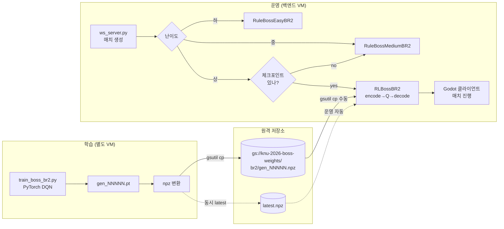

# BR2 보스 강화학습 (RL) 통합 가이드

> **대상**: BR2 보스전의 RL(난이도 "상") 정책을 이해·운영·확장하려는 팀원
> **버전**: 1 (2026-06-05, gen_00011 학습 직후)
> **상태**: 인프라 완성 ✅ / 초기 학습 PoC 완료 ⚠️ (실력 미달) / e2e Godot 검증 진행 중 🚧

---

## 0. 빠른 요약 (TL;DR)

- BR2 보스전 난이도 **"상"** 은 학습된 신경망(DQN)으로 행동을 결정한다 — 룰 보스("하/중") 대비 차별화 포인트.
- 학습은 **로컬 GCP VM** 에서 PyTorch 로 돌고, 산출물(`.npz`)이 **GCS** 에 올라간 뒤 **운영 백엔드**가 추론에 사용한다.
- 학습/운영은 **완전히 분리**(분리 학습-서빙) — 운영 노드는 numpy 만 있으면 추론 가능, PyTorch 불필요.
- 현재 가중치(`gen_00011.npz`)는 500 에피소드 학습으로 wire 검증용. **실력은 아직 룰 중급 폴백과 비슷하거나 약함** (win_rate=0.00 @ 마지막 20ep).

```
┌──────────────────┐     학습       ┌─────────────────┐    추론     ┌──────────────────┐
│ 학습 VM          │ ───────────►   │     GCS         │ ──────────► │  운영 백엔드     │
│ (PyTorch+CUDA?)  │   gen_*.npz    │ knu-2026-boss-  │  latest.npz │  (numpy only)    │
│ train_boss_br2.py│                │ weights/br2/    │             │ RLBossBR2 추론   │
└──────────────────┘                └─────────────────┘             └──────────────────┘
        ▲                                                                   │
        │ Cloud Scheduler 트리거(계획)                                       │
        │                                                                   ▼
   ┌────┴────┐                                                       ┌────────────┐
   │ Cron    │                                                       │  Godot 클라 │
   │ (의도)  │                                                       │ "상" 매치  │
   └─────────┘                                                       └────────────┘
```

---

## 1. 왜 강화학습인가 — RL 채택의 강점

룰 봇("하/중")은 옛 운영 경험에서 검증된 우선순위 트리지만, 다음 약점이 있다:

| 약점 (룰) | RL 의 우위 |
|---|---|
| 우선순위 트리는 임계값이 고정 → 환경 변화에 둔감 | 정책망이 **상태 벡터 80차** 를 동시에 보고 가중합 학습 |
| 새 봇 메타가 등장하면 룰 파라미터를 직접 패치해야 함 | 학습 데이터에 노출되면 **자동 적응** |
| "상" 난이도가 단순히 "중 + 강한 stat" 이 되면 다양성 부족 | **정성적 차별화** (위치 선점, 자원 우선순위, 위협 가중치 등) |
| 룰은 본질적으로 *반응형* | DQN 은 Q-value 로 **미래 보상까지 고려한 선택** 가능 |
| 정책 업데이트는 코드 배포 | 학습 → 가중치 교체만으로 정책 변경, **재배포 없음** |

다만 "RL 이라서 무조건 강하다"는 보장은 없다. 초기 학습이 부족하면 룰 봇보다 약하다 — 본 가이드 [04-status.md](04-status.md) 의 현 상황이 그 사례.

> **포지셔닝**: RL 은 "더 강해질 수 있는 잠재력" 이지 "항상 더 강하다"가 아니다. 운영 정책은 **체크포인트 미발견 시 자동 medium 폴백** 으로 사용자 경험을 보호한다.

---

## 2. 시스템 한눈에 보기



핵심:
- **학습 ↔ 운영 사이의 유일한 인터페이스는 `.npz` 가중치 파일** 이다. 환경, sim, 보상 함수가 운영 코드에 끼어들지 않는다.
- 운영 노드에 **PyTorch 의존 없음** (numpy 만으로 추론).

---

## 3. 디렉토리 매핑

```
loa-main/
├── backend/BattleRoyale2/
│   ├── bots/boss/
│   │   ├── rule/                   # 하/중 보스 (옛 우선순위 트리 BR2 포팅)
│   │   └── rl/
│   │       ├── encoder.py          # state(dict) → (80,) float32
│   │       ├── decoder.py          # int(0..19) → 7키 action dict
│   │       ├── network.py          # numpy MLP (추론 전용)
│   │       ├── inference.py        # RLBossBR2 — 운영 진입점
│   │       ├── league.py           # 체크포인트 풀 관리
│   │       ├── past_opponent.py    # 학습 중 freeze 상대
│   │       └── checkpoints/        # gen_*.npz (운영용)
│   ├── sim/                        # ★ 학습용 순수 Python 시뮬
│   │   └── mini_env.py             # BR2MiniEnv (충돌·HP·zone·아이템 단순화)
│   ├── scripts/train/
│   │   └── train_boss_br2.py       # ★ DQN 학습 스크립트
│   └── rules/boss_mode.py          # 보스 모드 환경 룰·stat 배수
└── docs/rl/                        # ★ 본 가이드 (이 디렉토리)
```

★ 표시는 본 세션(2026-06-04~05) 신설.

---

## 4. 문서 인덱스

| 챕터 | 내용 | 누구를 위해 |
|---|---|---|
| **[01-design.md](01-design.md)** | 보상 함수, 시나리오 mix, 인코더/디코더, DQN 하이퍼파라미터, 학습 루프 | RL 정책을 *수정* 하려는 사람 |
| **[02-serving.md](02-serving.md)** | 백엔드가 가중치를 인식·로드·추론하는 방식, 폴백 정책, npz 포맷 | 운영 백엔드를 *디버그* 하려는 사람 |
| **[03-infrastructure.md](03-infrastructure.md)** | 학습 VM 설계, GCS 레이아웃, Cloud Scheduler 의도(미완성), 비용 | 인프라를 *운영·확장* 하려는 사람 |
| **[04-status.md](04-status.md)** | gen_00011 학습 결과, 알려진 한계, 다음 단계 후보 | 현재 상태를 *정확히 알고 싶은* 사람 |

기존 자료(중복 부분 있음):
- [`docs/br2_boss_rl_design.md`](../br2_boss_rl_design.md) — 인프라 contract (2026-06-02 작성, 학습 환경 미결정 시점)
- [`docs/br2_boss_mode_protocol.md`](../br2_boss_mode_protocol.md) — Godot ↔ 백엔드 보스 모드 프로토콜
- [`docs/boss_bot.md`](../boss_bot.md) — 옛 BR1 보스봇 종합 문서 (참고용, BR1 좌표/룰)

---

## 5. 핵심 메모리 (의사결정 근거)

본 RL 작업은 옛 BR1 보스 학습 실패에서 얻은 교훈을 반영한다. 자세한 내용은 [01-design.md §3](01-design.md#3-보상-설계) 참조:

- **메모리 1번** — *직접 ClaudeBot 1대1 학습 금지*. 패율 93% × -50 패널티가 forgetting 유발.
  → BR2 에서는 `solo (2v1)` 시나리오 비중 **≤ 5%** 로 제한.
- **메모리 2번** — *solo 패배 패널티 -50 → -20 으로 완화* 후 사용 시에만 허용.
  → BR2 보상 `REWARD_LOSS_SOLO = -20.0`.

이 두 조건을 어기면 학습 수렴이 망가지는 사례가 옛 데이터에 있으므로, **하이퍼파라미터 튜닝 시 위 두 줄은 절대 풀지 말 것**.

---

## 6. 변경 이력

- **2026-06-05 v1** — 초안. 본 가이드 5문서 신설.
- 관련 PR/브랜치: `yoontaek` (본 문서 + 학습 인프라 코드).
