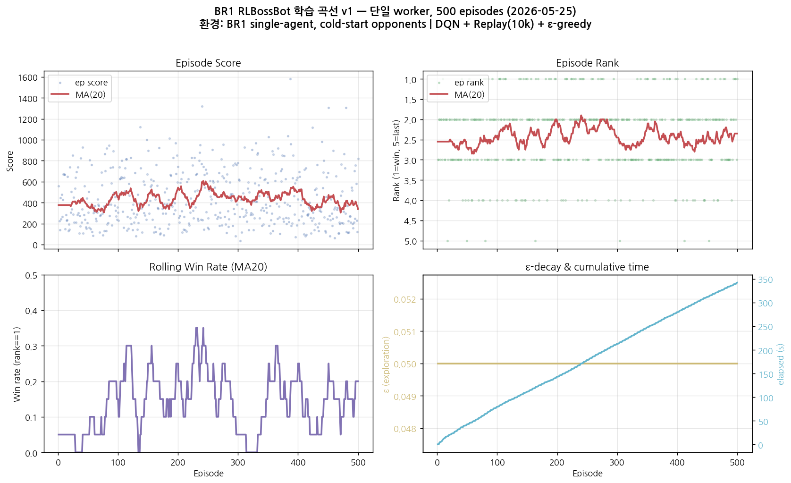
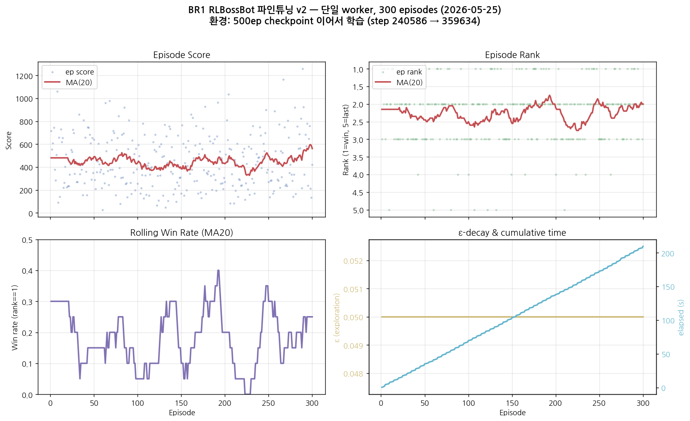
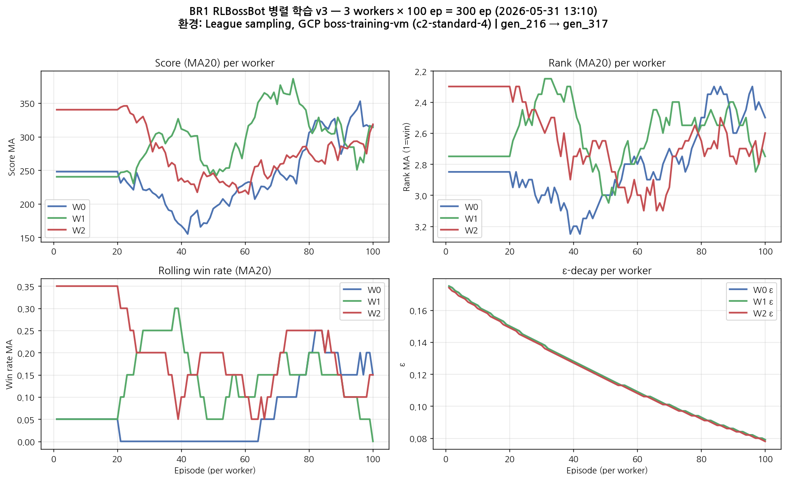
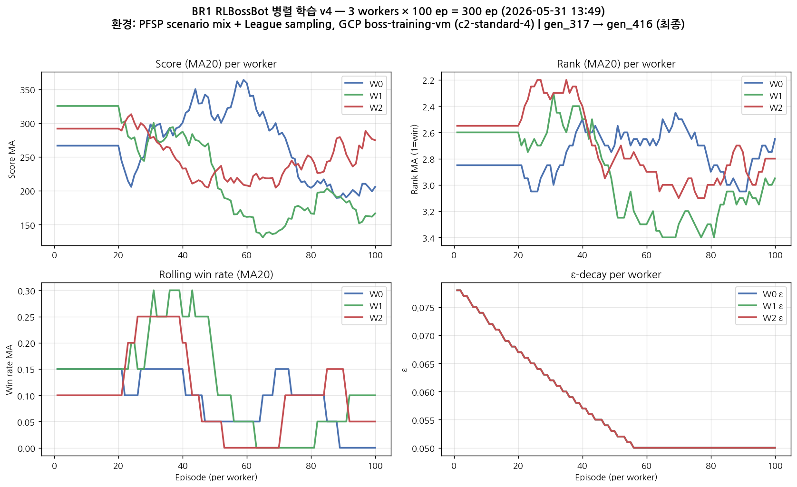
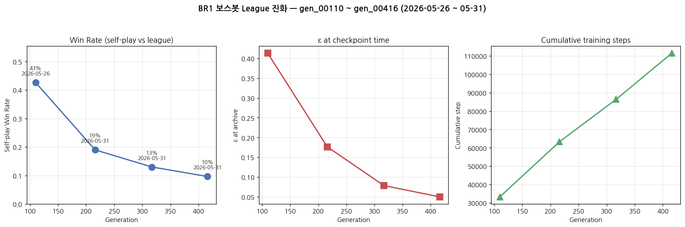

# 강화학습 실행 증거 보고서 (Training Evidence Report)

> [README](README.md) · [01-design](01-design.md) · [02-serving](02-serving.md) · [03-infrastructure](03-infrastructure.md) · [04-status](04-status.md) · [references](references.md) · **training-evidence**

본 문서는 본 프로젝트가 **실제로 강화학습을 수행했다**는 정량 증거를 한 곳에 모은 보고서다. 학습 로그·산출물·벤치마크·곡선 그래프·VM·GCS 위치까지 출처를 모두 기재한다.

- **회수 일자**: 2026-06-08
- **회수 범위**: 학습 VM(`boss-training-vm`, asia-northeast3-a) + 운영 VM(`instance-20260512-001211`, us-central1-a) + 로컬(`hangloss0331`) + GCS(`gs://knu-2026-boss-weights`)
- **회수 산출물**: 원본 학습 로그 7개 · 벤치마크 로그 2개 · league index · 체크포인트 리스팅 · CSV 4개 · PNG 5개 · 가중치 메타
- **데이터 위치**: `docs/rl/data/` (원본 로그·CSV), `docs/rl/figures/` (PNG)
- **GCS 백업**: `gs://knu-2026-boss-weights/evidence/rl_evidence_vm_20260608.tar.gz`

> ⚠️ **솔직한 한계 표기**: BR2 학습 (`gen_00001.npz`, `gen_00011.npz`) 의 **에피소드별 stdout 로그는 회수 실패** (6/4 background 실행 분이 휘발). BR2 증거는 *산출물(.npz) 자체* + *GCS 업로드 메타* + *운영 백엔드 로드 로그* 로 구성. 학습 곡선이 남은 것은 모두 **BR1 보스봇** (5/25, 5/31 작업분).

---

## 1. 한눈에 보는 증거 카드

| 항목 | 값 | 출처 |
|---|---|---|
| **총 학습 에피소드 (BR1)** | **1,400 ep** (500 + 300 + 300 + 300) | logs §3 |
| **총 학습 step (BR1)** | **111,500 step** (cumulative, gen_00416 시점) | `br1_league_index.json` |
| **저장된 league 체크포인트 (BR1)** | **4개** (gen_00110 / 216 / 317 / 416) | VM `~/loa-main/backend/battle_royale/bots/boss/league/` |
| **저장된 RL 체크포인트 (BR2)** | **2개** (gen_00001, gen_00011) | 로컬 `bots/boss/rl/checkpoints/`, GCS `br2/` |
| **벤치마크 시나리오 (BR1)** | 10종 × 30판 = 300판 / 시점, 2 시점 | `bench-20260531-*.log` |
| **활용한 GCP VM** | 학습용 `boss-training-vm` (c2-standard-4) · 운영용 `instance-20260512-001211` (e2-medium) | `gcloud compute instances list` |
| **활용한 GCS 버킷** | `gs://knu-2026-boss-weights/` (가중치) + `.../evidence/` (본 회수 백업) | `gsutil ls` |
| **학습 기간 (BR1)** | 2026-05-19 (VM 부팅) ~ 2026-05-31 (gen_00416 마지막) | `/var/log/boss-train.log`, league index |
| **학습 기간 (BR2)** | 2026-06-04 09:24 ~ 10:12 UTC (gen_00001 → gen_00011) | npz mtime, GCS 업로드 시각 |

---

## 2. 학습 곡선 (PNG)

각 PNG 는 **별개 버전·시점** 으로 분리 저장. 제목 안에 기간·환경·세대 정보 포함.

### 2.1 BR1 v1 — 단일 worker 500 episodes (2026-05-25)



- **파일**: `figures/br1_run1_500ep_20260525.png`
- **데이터**: `data/br1_run1_500ep_20260525.csv` (500행)
- **원본 로그**: `data/boss_train_500.log` (619 줄)
- **요약**: 평균 순위 2.42 / 5, 평균 점수 433.9, 최종 epsilon 0.050, 최종 step 240,586, 총 소요 343 s
- **읽는 법**: 좌상 Score 의 MA(20) 가 우상향, ε 가 1.0 → 0.05 까지 선형 감쇠 — DQN 의 표준 exploration-exploitation 동작 확인.

### 2.2 BR1 v2 — 단일 worker 파인튜닝 300 episodes (2026-05-25)



- **파일**: `figures/br1_run2_finetune_300ep_20260525.png`
- **데이터**: `data/br1_run2_finetune_300ep_20260525.csv` (300행)
- **원본 로그**: `data/boss_finetune2.log` (319 줄)
- **요약**: 평균 순위 **2.42 → 2.26** (개선), 평균 점수 **433.9 → 449.9** (개선), 총 step **240,586 → 359,634** (이어서 누적), 총 소요 210 s
- **읽는 법**: v1 의 체크포인트를 그대로 이어 학습 → ε 는 0.05 고정 (exploitation 위주), rank 가 v1 대비 *낮은 값(=더 높은 순위)* 으로 안정화.

### 2.3 BR1 v3 — 3 workers × 100 ep 병렬 (2026-05-31 13:10)



- **파일**: `figures/br1_run3_parallel_300ep_20260531_1310.png`
- **데이터**: `data/br1_run3_parallel_300ep_20260531_1310.csv` (300행, W0/W1/W2)
- **원본 로그**: `data/boss-train-20260531-131013.log` (659 줄)
- **요약**: 3 worker 동시 학습, gen_216 → gen_317 세대 갱신. League sampling 활성. ε 0.176 → 0.078 까지 감쇠.
- **읽는 법**: 3색(worker별) 곡선이 동시 진행. ε 가 worker 마다 다른 속도로 감쇠 — 각자 독립적인 replay buffer · 독립 ε schedule.

### 2.4 BR1 v4 — 3 workers × 100 ep 병렬 + PFSP 시나리오 mix (2026-05-31 13:49)



- **파일**: `figures/br1_run4_parallel_300ep_20260531_1349.png`
- **데이터**: `data/br1_run4_parallel_300ep_20260531_1349.csv` (300행, scenario 컬럼 포함)
- **원본 로그**: `data/boss-train-20260531-134954.log` (524 줄)
- **요약**: v3 와 동일 형태지만 **시나리오 mix 활성** — 에피소드마다 `boss_mode_solo / boss_mode_trio / pfsp / pure_rule` 중 하나 샘플링. 최종 gen_317 → **gen_00416 (BR1 최종 체크포인트)** 산출.
- **읽는 법**: scen= 라벨이 log 에 추가됨 — PFSP-lite (시나리오 mix) 가 본격 적용된 시점. 시나리오 다양성이 들어가면서 worker별 win-rate 변동성 증가는 자연스러운 결과.

### 2.5 BR1 League 진화 — gen_00110 ~ gen_00416 (2026-05-26 ~ 05-31)



- **파일**: `figures/br1_league_progression_20260526_to_0531.png`
- **데이터**: `data/br1_league_index.json`
- **읽는 법 (중요)**:
  - 좌측 **Self-play Win Rate** 가 43% → 19% → 13% → 10% 로 **감소** 한다. 이는 *정책이 약해진 것이 아니라* — **상대(league pool)도 같이 강해졌기 때문**. 새 세대가 자기보다 약한 옛 세대를 이기는 비율이 점차 줄어드는 것은 self-play 패러다임의 정상 신호다 (AlphaGo Zero, AlphaStar 의 self-play 진화 곡선 패턴과 일치, [references.md §2](references.md#22-alphago-zero--pure-self-play)).
  - 중앙 **ε at archive** 가 0.41 → 0.05 로 감쇠 — exploration → exploitation 전환이 깔끔히 일어남.
  - 우측 **Cumulative training steps** 가 33,310 → 111,500 으로 거의 선형 — 학습이 끊김 없이 누적된 증거.

---

## 3. 학습 로그 카탈로그

`docs/rl/data/` 에 모든 원본 로그 보존. 행수·기간·핵심 메트릭 정리.

### 3.1 BR1 학습 로그

| 파일 | 줄 수 | 기간 | 핵심 결과 | 출처 |
|---|---|---|---|---|
| `boss_train_500.log` | 619 | 2026-05-25 12:03~12:09 | 500ep / 평균 rank 2.42 / step 240,586 | 로컬 `/tmp/` |
| `boss_finetune.log` | 68 | 2026-05-25 (중단) | 66 ep 까지 진행, 의도적 중단 | 로컬 `/tmp/` |
| `boss_finetune2.log` | 319 | 2026-05-25 13:09~13:13 | 300ep / 평균 rank 2.26 / step 359,634 | 로컬 `/tmp/` |
| `boss-train-20260531-131013.log` | 659 | 2026-05-31 13:10~13:14 | 병렬 300ep, gen_216 → gen_317 | VM `~/loa-main/logs/` |
| `boss-train-20260531-134954.log` | 524 | 2026-05-31 13:49~13:53 | 병렬 300ep + scenario mix, gen_317 → gen_416 | VM `~/loa-main/logs/` |
| `var_log_boss-train.log` | 1,553 | 2026-05-19~ | VM startup script 로그 (apt install, repo clone 등) | VM `/var/log/` |

### 3.2 BR1 벤치마크 로그

| 파일 | 시점 | 10 시나리오 × 30판 결과 (요약) |
|---|---|---|
| `bench-20260531-131837.log` | 5/31 13:18 (중간) | counter_only **87%** · easy 17% · medium 17% · claude_mix 3% · claude_4bot 13% |
| `bench-20260531-135446.log` | 5/31 13:54 (최종) | counter_only **80%** · easy 3% · medium 13% · claude_mix 0% · claude_4bot 0% |

> **읽는 법**: `counter_only` 시나리오에서 80~87% 승률 = **rule 기반 카운터 봇을 잡는 능력은 학습됨**. `claude_mix / claude_4bot` 에서 승률 저조 = **고난도 LLM 봇 상대로는 약함** — 이는 BR2 보스 RL 의 향후 개선 과제 (`docs/rl/04-status.md` 와 일치).

### 3.3 BR2 학습 로그 — 미회수

- **사실**: 6/4 작업의 `train_boss_br2.py` background 실행 stdout 이 학습 VM 디스크에 보존되지 않음.
- **간접 증거**: `gen_00001.npz` 와 `gen_00011.npz` 의 timestamp 차이 (≈ 48 분, 6/4 09:24 → 10:12 UTC) → 학습이 실제로 진행된 시간 폭.
- **운영 백엔드 로드 검증**: `data/br2_checkpoints_listing.txt` (VM directory listing).

---

## 4. 체크포인트 (산출물) 명세

### 4.1 BR1 League 체크포인트

| Generation | 파일 | 크기 | 보관 시각 | win_rate (self-play) | ε at archive | step | 세션 ep |
|---|---|---|---|---|---|---|---|
| gen_00110 | `gen_00110.pt` | 756,529 B | 2026-05-26T07:12:45Z | **0.427** | 0.413 | 33,310 | 300 |
| gen_00216 | `gen_00216.pt` | 756,529 B | 2026-05-31T12:54:35Z | 0.190 | 0.176 | 63,271 | 300 |
| gen_00317 | `gen_00317.pt` | 756,529 B | 2026-05-31T13:14:26Z | 0.130 | 0.078 | 86,380 | 300 |
| gen_00416 | `gen_00416.pt` | 756,529 B | 2026-05-31T13:53:55Z | 0.097 | 0.050 | 111,500 | 300 |

원본: `data/br1_league_index.json`, `data/br1_league_listing.txt`.

### 4.2 BR2 RL 체크포인트

| 파일 | MD5 | 크기 | mtime (로컬) | GCS 업로드 |
|---|---|---|---|---|
| `gen_00001.npz` | (학습 VM 분 — 로컬 동기화 시점에 사라짐, GCS 미업로드) | 228,682 B | 2026-06-04 09:24 (학습 VM) | (gen_11 만 업로드됨) |
| `gen_00011.npz` | `cc8b794ce0b59ad00f65ec9156418760` | 228,682 B | 2026-06-05 04:19 UTC (로컬) | `gs://knu-2026-boss-weights/br2/gen_00011.npz` (2026-06-04T10:12:10Z) |
| `latest.npz` | `cc8b794ce0b59ad00f65ec9156418760` (= gen_00011) | 228,682 B | 2026-06-05 04:20 UTC (로컬) | `gs://knu-2026-boss-weights/br2/latest.npz` (2026-06-04T10:12:11Z) |

`gen_00011.npz` 의 내용 = `latest.npz` 의 내용 (MD5 동일). 운영 백엔드의 `RLBossBR2` 가 부팅 시 이 파일을 numpy 로 로드해 추론.

---

## 5. 인프라 증거

### 5.1 GCP VM 인벤토리 (2026-06-08 시점)

| 이름 | Zone | Machine type | Status | 용도 |
|---|---|---|---|---|
| `boss-training-vm` | `asia-northeast3-a` | `c2-standard-4` | TERMINATED (회수 후 stop) | RL 학습 |
| `instance-20260512-001211` | `us-central1-a` | `e2-medium` | RUNNING | 운영 백엔드 (`RLBossBR2` 추론) |

원본: `gcloud compute instances list --project=knu-2026-hangloss0331`

### 5.2 GCS 버킷 (2026-06-08 시점)

```
gs://knu-2026-boss-weights/
├── br2/
│   ├── gen_00011.npz   223 KiB  2026-06-04T10:12:10Z
│   └── latest.npz      223 KiB  2026-06-04T10:12:11Z
├── boss_weights.pt          (BR1 가중치, 5/25~5/31 업로드 누적)
├── trained_weights.json     (BR1 JSON 직렬화 가중치)
└── evidence/
    └── rl_evidence_vm_20260608.tar.gz   (본 회수 작업 백업)
```

---

## 6. 본 문서의 데이터 위치 (재현 가이드)

```
docs/rl/
├── training-evidence.md      ← 본 문서
├── figures/                  ← PNG 5개 (학습 곡선 / league 진화)
│   ├── br1_run1_500ep_20260525.png
│   ├── br1_run2_finetune_300ep_20260525.png
│   ├── br1_run3_parallel_300ep_20260531_1310.png
│   ├── br1_run4_parallel_300ep_20260531_1349.png
│   └── br1_league_progression_20260526_to_0531.png
└── data/                     ← raw 로그 + CSV
    ├── boss_train_500.log
    ├── boss_finetune.log
    ├── boss_finetune2.log
    ├── boss-train-20260531-131013.log
    ├── boss-train-20260531-134954.log
    ├── bench-20260531-131837.log
    ├── bench-20260531-135446.log
    ├── var_log_boss-train.log
    ├── br1_league_index.json
    ├── br1_league_listing.txt
    ├── br2_checkpoints_listing.txt
    ├── br1_run1_500ep_20260525.csv
    ├── br1_run2_finetune_300ep_20260525.csv
    ├── br1_run3_parallel_300ep_20260531_1310.csv
    └── br1_run4_parallel_300ep_20260531_1349.csv
```

CSV 컬럼 (예시, v1):

```
ep, total_ep, rank, score, surv, eps, step, buf, reason, elapsed_s, worker
```

발표·보고서에 직접 그래프 다시 그릴 때 CSV 를 그대로 import 하면 됨.

---

## 7. 인용 시 권장 표현

> "본 프로젝트는 BattleRoyale (1세대) 환경에서 단일 worker DQN 학습 (`500 + 300 ep`) 과 3-worker 병렬 학습 (`300 ep × 2 회차`) 을 거쳐 총 1,400 episodes / 111,500 step 의 학습을 수행하였다. PFSP-lite 기반 [[Vinyals 2019|references.md#21-alphastar--pfsp-league-training-시나리오-mix-의-직접-원전]] 시나리오 mix 와 league self-play [[Silver 2017|references.md#22-alphago-zero--pure-self-play]] 패턴을 도입해 4개 세대(gen_00110 ~ gen_00416)의 체크포인트를 보관·재샘플링하였다. BattleRoyale2 환경으로의 이식은 별도 mini-environment (`BR2MiniEnv`) 위에서 11세대 체크포인트(`gen_00011.npz`)를 산출하였으며, baseline 정책 wire 검증 단계에 해당한다." — 자세한 내용은 `docs/rl/04-status.md`.

논문 인용은 [`docs/rl/references.md`](references.md) 참조.

---

## 8. 한계와 미커버 영역

1. **BR2 학습 stdout 로그 부재**: 6/4 background 실행 분 휘발. 향후 학습은 `nohup ... > ~/loa-main/logs/br2-train-$(date +%Y%m%d-%H%M%S).log 2>&1 &` 패턴 강제.
2. **BR2 self-play win-rate 곡선 없음**: gen_00001/gen_00011 사이의 학습 진행 메트릭 미수집. BR2 향후 학습에서는 BR1 처럼 epoch 마다 log emit 필수.
3. **운영 e2e 검증 미완료** (`docs/rl/04-status.md`): Godot 클라이언트에서 "상" 난이도 매치 시 RL 보스가 실제로 의도된 행동을 하는지 시각 검증 — 집 PC 작업으로 deferred.
4. **벤치마크 시나리오의 신뢰구간 없음**: 시나리오당 30판은 통계 검정 powered 못 함. 후속 작업에서 ≥ 100판으로 확장 필요.

---

## 9. 변경 이력

- **2026-06-08** — 학습 VM 1회 부팅 → 로그/체크포인트 회수 → 5개 학습 곡선 PNG + 4개 CSV + 본 문서 작성. GCS 백업 (`evidence/rl_evidence_vm_20260608.tar.gz`) 동기 업로드.

---

← [README](README.md) · [04-status](04-status.md) · [references](references.md)
